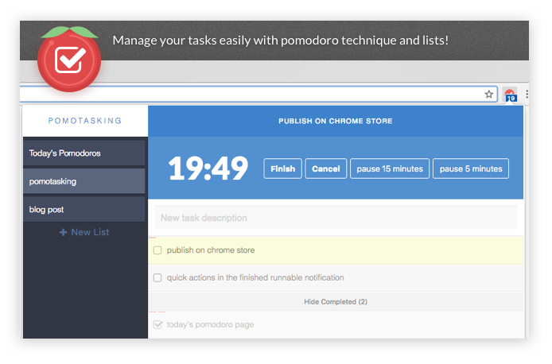

  

A Chrome extension pomodoro timer integrated with ToDo list.

**[Install through the Chrome Web Store](https://chrome.google.com/webstore/detail/pomotasking/diofopnenjmjcpcimiimefbcmjahgldg)**

  

## Setup

1. Install [yarn](https://yarnpkg.com): `npm install -g yarn`.
2. Run `yarn`.
3. Run `yarn start`.
4. Load the extension in Chrome:
    1. Access `chrome://extensions/`
    2. Check `Developer mode`
    3. Click on `Load unpacked extension`
    4. Select the `build` folder.

-------------
Samuel Simões ~ [@samuelsimoes](https://twitter.com/samuelsimoes) ~ [Blog](http://blog.samuelsimoes.com/)
